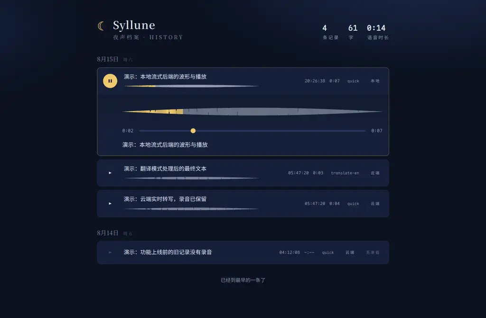
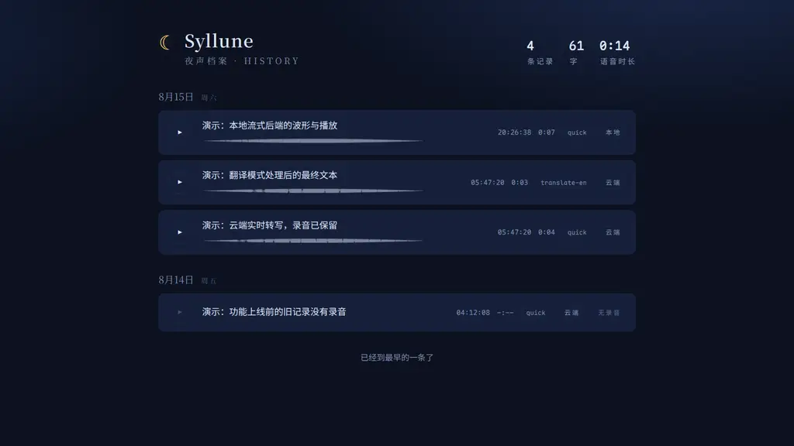
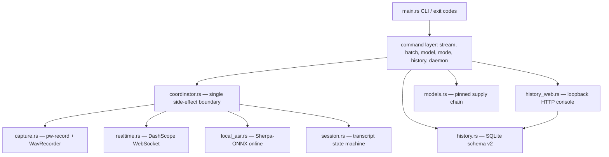

<p align="center">
  
</p>

<p align="center">
  <strong>Realtime voice input for NixOS and Wayland — one Rust binary, one hotkey.</strong><br>
  <a href="README.md">English</a> · <a href="README.zh.md">中文</a>
</p>

<p align="center">
  <a href="https://github.com/Vitus213/syllune/actions"></a>
  <a href="LICENSE"></a>
  <a href="https://www.rust-lang.org"></a>
  <a href="https://nixos.org"></a>
  <a href="https://pipewire.org"></a>
</p>

Syllune records audio with PipeWire (`pw-record`) at 16 kHz mono PCM16, transcribes while you speak (DashScope cloud realtime by default, or the local Sherpa-ONNX streaming Paraformer), and types the final text into the focused window with `wtype` or the clipboard method. One binary: no Python runtime, no desktop shell.

**Quick start**

```bash
nix run github:Vitus213/syllune -- doctor   # Check pw-record, wtype and wl-copy
nix run github:Vitus213/syllune -- stream   # Speak, press Ctrl-C, and Syllune types the text
```

Contents: [Compatibility](#compatibility) · [Install](#install) · [First run](#first-run) · [Commands](#commands) · [Configuration](#configuration) · [Modes and injection](#modes-and-injection) · [History, recordings and web console](#history-recordings-and-web-console) · [Model catalog](#model-catalog) · [Design](#design) · [Migration from type4me-linux](#migration-from-type4me-linux) · [Development](#development)

## Compatibility

| Layer | Requirement | Note |
| --- | --- | --- |
| OS | NixOS or Linux, `x86_64` or `aarch64` | The flake declares only these two systems |
| Display server | Wayland | Injection uses `wtype`; the clipboard method and fallback use `wl-copy` |
| Audio | PipeWire | Capture spawns `pw-record` (16 kHz mono PCM16) |
| Compositor shortcuts | XDG Desktop Portal `GlobalShortcuts` (best effort) | Without the portal, the `dev.syllune.Daemon` D-Bus bus works; the Home Manager module ships a Sway binding |
| Cloud ASR | DashScope realtime endpoint (`qwen3-asr-flash-realtime`) | Requires an API key |
| Local ASR | Sherpa-ONNX streaming Paraformer (`streaming-paraformer-bilingual-zh-en`) | Install it with `syllune model install`; Syllune verifies it before each session |
| Batch ASR | DashScope multimodal or local SenseVoice | Used by `transcribe` and `record` |

X11, macOS and Windows are not supported.

## Install

### Run without installation (Nix flake, recommended)

```bash
nix run github:Vitus213/syllune -- doctor
```

### Run from a local checkout

```bash
nix run . -- doctor
```

### Install with the flake overlay

Add the input and the package to your NixOS or home configuration:

```nix
{
  inputs.syllune.url = "github:Vitus213/syllune";

  outputs = { nixpkgs, syllune, ... }: {
    # For example in environment.systemPackages or home.packages:
    home.packages = [ syllune.packages.${system}.syllune ];
    # Or: nixpkgs.overlays = [ syllune.overlays.default ]; then use pkgs.syllune
  };
}
```

### Install with Home Manager

The flake includes `homeManagerModules.default`. The module performs these tasks:

- Install the package.
- Manage `~/.config/syllune/config.toml`.
- Run the headless daemon (optional).
- Add a Sway hotkey (optional).

```nix
{
  inputs.syllune.url = "github:Vitus213/syllune";

  imports = [ inputs.syllune.homeManagerModules.default ];

  programs.syllune = {
    enable = true;
    settings.asr.streaming_backend = "cloud-realtime"; # or "local-streaming"
    settings.cloud.api_key = "sk-...";                 # the generated file has mode 0600
    service.enable = true;                             # run `syllune daemon` persistently
    shortcuts.sway.enable = true;                      # $mod+Shift+d toggles recording
  };
}
```

`shortcuts.sway` adds only the Sway binding. You configure the GlobalShortcuts portal backend at the NixOS level. Without the portal, the daemon still works through D-Bus.

### Build from source (development)

```bash
nix develop
cargo test --all-targets
cargo fmt && cargo clippy --all-targets --all-features -- -D warnings
nix flake check -L
```

The development shell provides `cargo`, `pipewire`, `wtype`, `wl-clipboard` and the Sherpa-ONNX and ONNX runtime libraries. `SHERPA_ONNX_LIB_DIR` is already set.

## First run

1. Run `syllune doctor`. It checks `pw-record`, `wtype`, `wl-copy` and the data directory.
2. Run `syllune stream`.
3. Speak.
4. Press Ctrl-C once. Syllune stops the capture and types the final text.
5. Or press Ctrl-C twice. Syllune cancels and types nothing.

Stop rules:

- The first Ctrl-C (or the second hotkey activation, or the end of the capture) stops the capture. Syllune flushes the last audio frame, sends one finish signal and types the final text once.
- The second Ctrl-C or SIGTERM cancels the session. Syllune never types partial text.

The configuration file is `~/.config/syllune/config.toml`. The parser is strict: unknown keys are errors. A file that contains `api_key` must have mode `0600` or stricter.

```toml
[asr]
streaming_backend = "cloud-realtime"   # or "local-streaming"

[cloud]
api_key = "sk-..."
realtime_endpoint = "wss://dashscope.aliyuncs.com/api-ws/v1/realtime"
realtime_model = "qwen3-asr-flash-realtime"
```

To use the local backend, install the model once:

```bash
syllune model install streaming-paraformer-bilingual-zh-en
syllune stream --backend local-streaming
```

## Commands

| Command | Purpose |
| --- | --- |
| `syllune stream` | Record and transcribe in realtime. Options: `--backend`, `--mode`, `--json`, `--no-inject` |
| `syllune transcribe <wav>` | Transcribe one WAV file (cloud DashScope or local SenseVoice) |
| `syllune record --seconds N` | Record for N seconds, then transcribe |
| `syllune model list\|install\|check\|remove` | Manage the model catalog (pinned URLs, byte counts, SRI SHA-256, member allowlist) |
| `syllune mode list\|reload\|add\|update\|remove` | Manage text processing modes |
| `syllune history list\|delete\|export\|totals\|usage` | Query the recognition history (SQLite) |
| `syllune history serve` | Start the local web console. Options: `--host`, `--port`. Default: `http://127.0.0.1:8790` |
| `syllune daemon` | Run the headless daemon. It exports `dev.syllune.Daemon.Controller` on D-Bus. Options: `--mode` (default `quick`) |
| `syllune doctor` | Check dependencies and the data directory |
| `syllune benchmark asr\|latency` | Run the CER and stop-to-inject latency gates. Without credentials or a Wayland injector they report skip and never report a pass |

## Configuration

Full key reference. All keys are optional; the values below are the defaults:

```toml
[asr]
streaming_backend = "cloud-realtime"   # cloud-realtime | local-streaming
batch_backend = "cloud"                # cloud | local (SenseVoice)
# local_model_dir / batch_model_dir: override the managed model locations

[cloud]
api_key = ""                           # required for cloud backends; file mode must be 0600
base_url = "https://dashscope.aliyuncs.com"
model = "qwen3-asr-flash-2026-02-10"
timeout_seconds = 60.0
realtime_endpoint = "wss://dashscope.aliyuncs.com/api-ws/v1/realtime"
realtime_model = "qwen3-asr-flash-realtime"

[inject]
prefer = "wtype"                       # wtype | clipboard
wtype_command = "wtype"
wl_copy_command = "wl-copy"
paste_command = "-M ctrl -k v"         # args passed to paste_tool
paste_tool = "wtype"                    # the paste-keystroke provider: wtype | xdotool | ...
focus_command = ""                     # optional: raise the target window before pasting
x11_clipboard_command = ""             # optional: mirror text to X11 clipboard (e.g. "xsel --clipboard --input"); the previous selection is restored after injection
clipboard_fallback = true
timeout_seconds = 10.0

[processing]
provider = "none"                      # none | openai-compatible | ollama
base_url = "https://dashscope.aliyuncs.com/compatible-mode/v1"  # BaiLian OpenAI-compatible endpoint
model = "deepseek-v4-flash-0731"       # recognition/reformatting model (cloud recognition)
api_key = ""                           # direct key; takes precedence over api_key_env
api_key_env = ""                       # name of the environment variable that holds the key (fallback)
prompt = ""                            # optional: overrides the prompt-optimize organizing template ({text} placeholder)
timeout_seconds = 30.0

[history]
enabled = true
save_audio = true                      # keep one WAV per successful session
```

The old values `cloud-vad`, `sensevoice-vad` and `final_backend` are rejected. Syllune never rewrites them silently.

`[inject]` selects how the final text reaches the focused window. `prefer = "wtype"` types it through the Wayland virtual keyboard. `prefer = "clipboard"` copies it with `wl-copy` and synthesizes the `paste_command` keypress instead; paste delivers the text verbatim, so apps whose input method (Fcitx5) reinterprets typed keys -- WeChat and other IME-controlled XWayland apps -- receive clean text. Rootless Xwayland (xwayland-satellite) does not forward Wayland selections to X11 clients, so when `x11_clipboard_command` is set (for example `xsel --clipboard --input`) the clipboard method also mirrors the text to the X11 clipboard, best effort. With `clipboard_fallback = true`, a failed wtype injection retries through the clipboard.

## Modes and injection

The `quick` mode types the recognized text directly. It makes no external calls. The other modes (polish, prompt optimization, translate to English) send the final text to the `[processing]` provider. `[processing]` is a dedicated "cloud recognition" config: its `base_url`, `model` and `api_key` are specified independently of realtime transcription and batch transcription (`[cloud]`), and its `prompt` field overrides the prompt-optimize organizing template (defaults to the original type4me design, "rewrite the requirement as a clear, executable prompt"; `{text}` is replaced by the transcript before the request is assembled and sent). If the processing fails, Syllune keeps the raw text and prints a warning. Syllune types the final text at most once. The history stores only successful texts.

## History, recordings and web console

Each successful streaming session saves its audio. Syllune writes a 16 kHz mono WAV file to `~/.local/share/syllune/audio/` (about 115 KB per minute). The history database stores `audio_path` and `duration_seconds` (schema v2; Syllune migrates v1 databases when it opens them).

Cancelled, failed and empty sessions save no file. `history delete` and `delete --all` remove the recordings together with their rows. `[history] save_audio = false` disables the retention.

Start the console:

```bash
syllune history serve            # http://127.0.0.1:8790/
syllune history serve --port 9000
```




The console is one embedded page. It listens only on the loopback address. It shows:

- Records grouped by day.
- Waveforms rendered from the saved WAV files.
- Playback on click, with a seekable progress bar.
- Totals for records, characters and audio time.
- Cursor pagination.
- Edit and save the organizing prompt template; the next voice session picks it up immediately.

Audio URLs contain only the record id. The server reads the file path from the database row. It supports `Range` requests, so browsers can play while they download.

## Model catalog

| ID | Version and bytes | Pinned source and SRI SHA-256 |
| --- | --- | --- |
| `streaming-paraformer-bilingual-zh-en` | `asr-models-2024-03-10`; `1047319737` | <https://github.com/k2-fsa/sherpa-onnx/releases/download/asr-models/sherpa-onnx-streaming-paraformer-bilingual-zh-en.tar.bz2><br>`sha256-VGKh/OQmk96uVyrx6MRocSSxKqhf5h/00xaLtSgOIF8=` |

The install process verifies the SRI hash and the byte count over HTTPS. It rejects archive members that are not in the allowlist. It writes a manifest with per-file hashes. It activates the model atomically with a `versions/<id>/<version>-<digest12>` directory and a `current` symlink. Syllune verifies the model again before each session. It never uses a corrupted model. `syllune model list --json` reports the license status in the `license_status` field. Verify the license independently before you redistribute the model.

## Migration from type4me-linux

Syllune uses only XDG directories with the `syllune` name. It never reads, moves or deletes the old `type4me-linux` directories. To migrate manually:

1. Configuration. Copy the `[cloud]` section from `~/.config/type4me-linux/config.toml` to the new file. Set `streaming_backend` to `cloud-realtime` or `local-streaming`. The old values are removed.
2. Models. Run `syllune model install streaming-paraformer-bilingual-zh-en`. The catalog is independent; Syllune does not reuse old files.
3. History. Syllune does not import the old SQLite history. Export it to CSV with the old tool if you need it.

Rollback: install the old `type4me-linux` release again. The two applications never touch the state of each other.

## Design

One binary with layered boundaries. `coordinator::run_session` is the only orchestration boundary of a realtime session. Each environment (capture, transport, injector, processor, history, sink) is a trait. The CLI and the daemon share one pipeline. Tests replace any side with a fake.



Design decisions:

1. **Bounded lossless audio flow.** Chunks enter a queue of 16 slots of 32 ms. If the queue is full, or one send exceeds the 500 ms deadline, the session fails. Syllune never drops or reorders audio.
2. **Connect before capture.** The ready gate runs before `pw-record` starts. Authentication and connection failures produce no audio.
3. **Fixed stop order, one injection.** Stop new chunks, stop the capture, flush the tail frame, drain the queue in FIFO order, send exactly one `finish`, read the final events, type at most once. Cancel paths type no partial text.
4. **Recording as a decorator.** `WavRecorder` wraps `AudioCapture` and mirrors chunks into a `.partial` file. Only successful sessions finalize the WAV. A mirror failure disables only the saving; it never affects recognition, injection or history. Cancel and drop remove the temporary file. Audio rows and files are created and deleted together.
5. **Parameterized control source.** `stream::run_with_control` receives the command channel. The CLI maps SIGINT and SIGTERM (first signal stops, second cancels). The daemon maps the hotkey Activate and Cancel through a gateway state machine. The gateway allows only one session at a time.
6. **Private XDG persistence.** The configuration has a 0600 key gate. The history is a WAL SQLite file with mode 0600. Recordings live in `data/audio/`. Models activate atomically and Syllune verifies them before each session. User data never lives in the Nix store.
7. **Zero-dependency console.** `history_web` is a hand-written HTTP/1.1 server on tokio TCP. It accepts only GET, sends one response per connection and listens only on loopback. The frontend is embedded with `include_str!`. Audio URLs contain only the record id; the server reads the file path from the database row.
8. **Strict configuration contract.** Unknown keys are errors. Removed legacy values are rejected; Syllune never rewrites them silently.

The full runtime, persistence and integration contract is in [`docs/architecture.md`](docs/architecture.md). It includes the session lifecycle diagram and the measured quality gates.

## Development

```bash
just test    # nix develop -c cargo test --all-targets
just lint    # cargo fmt --check + clippy -D warnings
just check   # lint + test + nix flake check -L
just run …   # nix run . -- …
```

The real quality gate is `benchmark asr` (CER ≤ 0.02). The real latency gate is `benchmark latency` (stop-to-inject p99 ≤ 1.0 s). Both are documented in `docs/low-latency-rust-plan.md` and the OpenSpec change. Without real credentials or a Wayland injection environment they report skip and never report a pass.

Design documents: `openspec/changes/migrate-syllune-native-streaming/`. Low-latency plan: `docs/low-latency-rust-plan.md`.

## Related

- PipeWire: <https://pipewire.org/>
- Sherpa-ONNX: <https://github.com/k2-fsa/sherpa-onnx>
- XDG Desktop Portal: <https://flatpak.github.io/xdg-desktop-portal/>
