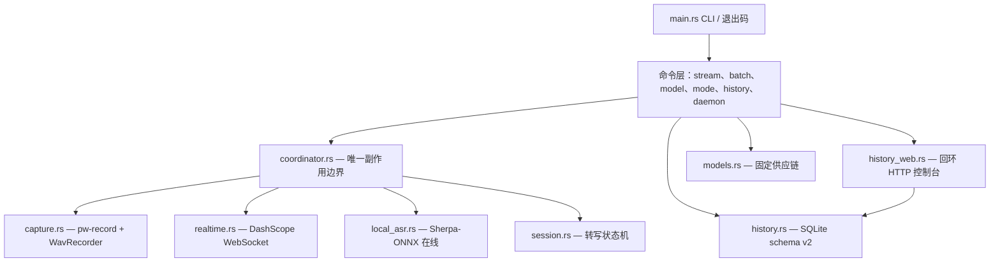

<p align="center">
  
</p>

<p align="center">
  <strong>面向 NixOS 与 Wayland 的实时语音输入 —— 单个 Rust 二进制，一个快捷键。</strong><br>
  <a href="README.md">English</a> · <a href="README.zh.md">中文</a>
</p>

<p align="center">
  <a href="https://github.com/Vitus213/syllune/actions"></a>
  <a href="LICENSE"></a>
  <a href="https://www.rust-lang.org"></a>
  <a href="https://nixos.org"></a>
  <a href="https://pipewire.org"></a>
</p>

Syllune 用 PipeWire（`pw-record`）以 16 kHz 单声道 PCM16 录音，说话期间持续转写（默认 DashScope 云端实时，或本地 Sherpa-ONNX 流式 Paraformer），结束后用 `wtype` 或剪贴板方式把最终文本打进焦点窗口。单个二进制：无 Python 运行时、无桌面外壳。

**快速开始**

```bash
nix run github:Vitus213/syllune -- doctor   # 检查 pw-record、wtype、wl-copy
nix run github:Vitus213/syllune -- stream   # 说话，按 Ctrl-C，Syllune 注入文本
```

目录：[适配](#适配) · [安装](#安装) · [首次运行](#首次运行) · [命令](#命令) · [配置](#配置) · [模式与注入](#模式与注入) · [历史、录音与 Web 控制台](#历史录音与-web-控制台) · [模型目录](#模型目录) · [设计](#设计) · [从 type4me-linux 迁移](#从-type4me-linux-迁移) · [开发](#开发)

## 适配

| 层 | 要求 | 说明 |
| --- | --- | --- |
| 系统 | NixOS 或 Linux，`x86_64` 或 `aarch64` | flake 仅声明这两个 system |
| 显示服务器 | Wayland | 注入用 `wtype`，剪贴板方式与兜底用 `wl-copy` |
| 音频 | PipeWire | 采集进程为 `pw-record`（16 kHz 单声道 PCM16） |
| 合成器快捷键 | XDG Desktop Portal `GlobalShortcuts`（尽力而为） | 无门户时 `dev.syllune.Daemon` D-Bus 总线可用；Home Manager 模块自带 Sway 绑定 |
| 云端 ASR | DashScope 实时端点（`qwen3-asr-flash-realtime`） | 需要 API key |
| 本地 ASR | Sherpa-ONNX 流式 Paraformer（`streaming-paraformer-bilingual-zh-en`） | 用 `syllune model install` 安装，每次会话前校验 |
| 批量 ASR | DashScope 多模态或本地 SenseVoice | 供 `transcribe` 与 `record` 使用 |

不支持 X11、macOS、Windows。

## 安装

### 免安装运行（Nix flake，推荐）

```bash
nix run github:Vitus213/syllune -- doctor
```

### 本地检出运行

```bash
nix run . -- doctor
```

### 通过 flake overlay 安装

把 input 与包加入 NixOS 或 home 配置：

```nix
{
  inputs.syllune.url = "github:Vitus213/syllune";

  outputs = { nixpkgs, syllune, ... }: {
    # 例如 environment.systemPackages 或 home.packages：
    home.packages = [ syllune.packages.${system}.syllune ];
    # 或：nixpkgs.overlays = [ syllune.overlays.default ]; 之后用 pkgs.syllune
  };
}
```

### 通过 Home Manager 安装

flake 提供 `homeManagerModules.default`。模块完成以下任务：

- 安装包。
- 管理 `~/.config/syllune/config.toml`。
- 运行 headless daemon（可选）。
- 添加 Sway 快捷键（可选）。

```nix
{
  inputs.syllune.url = "github:Vitus213/syllune";

  imports = [ inputs.syllune.homeManagerModules.default ];

  programs.syllune = {
    enable = true;
    settings.asr.streaming_backend = "cloud-realtime"; # 或 "local-streaming"
    settings.cloud.api_key = "sk-...";                 # 生成的文件权限为 0600
    service.enable = true;                             # 常驻 `syllune daemon`
    shortcuts.sway.enable = true;                      # $mod+Shift+d 切换录音
  };
}
```

`shortcuts.sway` 只添加 Sway 绑定。GlobalShortcuts 门户后端在 NixOS 层配置。无门户时 daemon 仍通过 D-Bus 工作。

### 源码构建（开发）

```bash
nix develop
cargo test --all-targets
cargo fmt && cargo clippy --all-targets --all-features -- -D warnings
nix flake check -L
```

开发 shell 提供 `cargo`、`pipewire`、`wtype`、`wl-clipboard` 以及 Sherpa-ONNX 与 ONNX 运行时库。`SHERPA_ONNX_LIB_DIR` 已预设。

## 首次运行

1. 运行 `syllune doctor`。它检查 `pw-record`、`wtype`、`wl-copy` 与数据目录。
2. 运行 `syllune stream`。
3. 说话。
4. 按一次 Ctrl-C。Syllune 停止采集并注入最终文本。
5. 或按两次 Ctrl-C。Syllune 取消，不注入任何文本。

停止规则：

- 第一次 Ctrl-C（或第二次热键激活、采集结束）停止采集。Syllune 冲刷尾帧、发送一次完成信号、注入一次最终文本。
- 第二次 Ctrl-C 或 SIGTERM 取消会话。Syllune 不注入任何部分文本。

配置文件为 `~/.config/syllune/config.toml`。解析器严格：未知键报错。含 `api_key` 的文件权限必须不宽于 0600。

```toml
[asr]
streaming_backend = "cloud-realtime"   # 或 "local-streaming"

[cloud]
api_key = "sk-..."
realtime_endpoint = "wss://dashscope.aliyuncs.com/api-ws/v1/realtime"
realtime_model = "qwen3-asr-flash-realtime"
```

使用本地后端时，先安装模型一次：

```bash
syllune model install streaming-paraformer-bilingual-zh-en
syllune stream --backend local-streaming
```

## 命令

| 命令 | 说明 |
| --- | --- |
| `syllune stream` | 实时录音转写。选项：`--backend`、`--mode`、`--json`、`--no-inject` |
| `syllune transcribe <wav>` | 转写一个 WAV 文件（云端 DashScope 或本地 SenseVoice） |
| `syllune record --seconds N` | 录音 N 秒后转写 |
| `syllune model list\|install\|check\|remove` | 管理模型目录（固定 URL、字节数、SRI SHA-256、成员白名单） |
| `syllune mode list\|reload\|add\|update\|remove` | 管理文本处理模式 |
| `syllune history list\|delete\|export\|totals\|usage` | 查询识别历史（SQLite） |
| `syllune history serve` | 启动本地 Web 控制台。选项：`--host`、`--port`。默认：`http://127.0.0.1:8790` |
| `syllune daemon` | 运行 headless daemon，在 D-Bus 导出 `dev.syllune.Daemon.Controller`。选项：`--mode`（默认 `quick`） |
| `syllune doctor` | 检查依赖与数据目录 |
| `syllune benchmark asr\|latency` | 运行 CER 与 stop→inject 延迟门禁。缺凭据或 Wayland 注入环境时报告 skip，不报告通过 |

## 配置

完整键参考。所有键可选，下列为默认值：

```toml
[asr]
streaming_backend = "cloud-realtime"   # cloud-realtime | local-streaming
batch_backend = "cloud"                # cloud | local（SenseVoice）
# local_model_dir / batch_model_dir：覆盖托管模型位置

[cloud]
api_key = ""                           # 云端后端必需；文件权限必须 0600
base_url = "https://dashscope.aliyuncs.com"
model = "qwen3-asr-flash-2026-02-10"
timeout_seconds = 60.0
realtime_endpoint = "wss://dashscope.aliyuncs.com/api-ws/v1/realtime"
realtime_model = "qwen3-asr-flash-realtime"

[inject]
prefer = "wtype"                       # wtype | clipboard
wtype_command = "wtype"
wl_copy_command = "wl-copy"
paste_command = "-M ctrl -k v"         # 传给 paste_tool 的粘贴按键参数
paste_tool = "wtype"                    # 粘贴按键提供者：wtype | xdotool | ...
focus_command = ""                     # 可选：粘贴前先把目标窗口提到前台
x11_clipboard_command = ""             # 可选：把文本镜像到 X11 剪贴板（如 "xsel --clipboard --input"）；注入后会还原原剪贴板
clipboard_fallback = true
timeout_seconds = 10.0

[processing]
provider = "none"                      # none | openai-compatible | ollama
base_url = "https://dashscope.aliyuncs.com/compatible-mode/v1"  # 百炼 OpenAI 兼容端点
model = "deepseek-v4-flash-0731"       # 整理/识别模型（云端识别）
api_key = ""                           # 直接写入密钥；优先于 api_key_env
api_key_env = ""                       # 存放密钥的环境变量名（备选）
prompt = ""                            # 可选：覆盖「提示词优化」的整理提示词模板（含 {text}）
timeout_seconds = 30.0

[history]
enabled = true
save_audio = true                      # 每次成功会话保留一份 WAV
```

旧值 `cloud-vad`、`sensevoice-vad`、`final_backend` 会被拒绝。Syllune 不静默改写。

`[inject]` 决定最终文本如何进入焦点窗口。`prefer = "wtype"` 通过 Wayland 虚拟键盘逐键输入；`prefer = "clipboard"` 先用 `wl-copy` 复制文本，再合成 `paste_command` 按键粘贴——粘贴按原样投递文本，因此输入法（Fcitx5）会重解释按键的应用（微信等 XWayland IME 应用）也能收到干净文本。无根 Xwayland（xwayland-satellite）不会把 Wayland 选区转发给 X11 客户端，因此设置 `x11_clipboard_command`（例如 `xsel --clipboard --input`）后，剪贴板方式会尽力把文本镜像到 X11 剪贴板。`clipboard_fallback = true` 时，wtype 注入失败会自动改用剪贴板重试。

## 模式与注入

`quick` 模式直接注入识别文本，无外部调用。其他模式（润色、提示词优化、翻译为英文）把最终文本发给 `[processing]` 提供者：`[processing]` 是独立的「云端识别」配置，`base_url`、`model`、`api_key` 与实时转写、批量转写（`[cloud]`）分开指定；`prompt` 字段可自定义「提示词优化」用的整理提示词模板，默认为 type4me 原设计「将以下需求改写为清晰、可执行的提示词」，模板中的 `{text}` 会被替换为转写正文后再拼装发送。处理失败时 Syllune 保留原文并输出 warning。Syllune 至多注入一次最终文本；历史只记录成功的文本。

## 历史、录音与 Web 控制台

每次成功的流式会话保存音频。Syllune 把 16 kHz 单声道 WAV 写入 `~/.local/share/syllune/audio/`（约 115 KB/分钟）。历史库记录 `audio_path` 与 `duration_seconds`（schema v2；打开 v1 库时自动迁移）。

取消、失败、空会话不保存文件。`history delete` 与 `delete --all` 连同录音一起删除。`[history] save_audio = false` 关闭保留。

启动控制台：

```bash
syllune history serve            # http://127.0.0.1:8790/
syllune history serve --port 9000
```


控制台是单个内嵌页面，只监听回环地址。它显示：

- 按天分组的记录。
- 从保存的 WAV 渲染的波形。
- 点击播放，进度可拖拽。
- 记录数、字数、语音时长统计。
- 游标分页。
- 编辑并保存「转写提示词」（整理用提示词模板），保存后下次语音输入立即生效。

音频 URL 只含 record id。服务端从数据库行读取文件路径。支持 `Range` 请求，浏览器可边下边播。

## 模型目录

| ID | 版本与字节数 | 固定源与 SRI SHA-256 |
| --- | --- | --- |
| `streaming-paraformer-bilingual-zh-en` | `asr-models-2024-03-10`；`1047319737` | <https://github.com/k2-fsa/sherpa-onnx/releases/download/asr-models/sherpa-onnx-streaming-paraformer-bilingual-zh-en.tar.bz2><br>`sha256-VGKh/OQmk96uVyrx6MRocSSxKqhf5h/00xaLtSgOIF8=` |

安装过程经 HTTPS 校验 SRI 哈希与字节数；拒绝白名单外的归档成员；写入按文件哈希的 manifest；用 `versions/<id>/<version>-<digest12>` 目录与 `current` 符号链接原子激活。Syllune 每次会话前重新校验模型，不使用损坏模型。`syllune model list --json` 在 `license_status` 字段报告许可证状态；再分发前请独立核验许可证。

## 从 type4me-linux 迁移

Syllune 只使用 `syllune` 命名的 XDG 目录，不读取、移动、删除旧 `type4me-linux` 目录。手动迁移：

1. 配置。把 `~/.config/type4me-linux/config.toml` 的 `[cloud]` 段复制到新文件；把 `streaming_backend` 改为 `cloud-realtime` 或 `local-streaming`（旧值已删除）。
2. 模型。运行 `syllune model install streaming-paraformer-bilingual-zh-en`。目录独立，Syllune 不复用旧文件。
3. 历史。Syllune 不导入旧 SQLite 历史；需要时用旧工具导出 CSV。

回滚：重新安装旧版 `type4me-linux`。两个应用互不触碰对方状态。

## 设计

单二进制、分层边界。`coordinator::run_session` 是实时会话唯一的编排边界。每个环境（采集、传输、注入器、处理器、历史、事件槽）都是 trait；CLI 与 daemon 共享一条管道；测试用 fake 替换任意一边。



设计决策：

1. **有界无损音频流。** chunk 进入 16 槽 ×32 ms 队列。队列满或单块发送超 500 ms deadline 时会话失败。Syllune 不丢块、不重排。
2. **连接先于采集。** ready 门在 `pw-record` 启动前运行。鉴权与连接失败不产生音频。
3. **固定停止次序、一次注入。** 停止新块 → 停采集 → 冲刷尾帧 → FIFO drain → 恰好一次 `finish` → 读最终事件 → 至多注入一次。取消路径不注入部分文本。
4. **录音是装饰器。** `WavRecorder` 包装 `AudioCapture`，把 chunk 镜像进 `.partial` 文件。只有成功会话 finalize WAV。镜像失败只禁用保存，不影响识别、注入、历史。cancel 与 drop 删除临时文件。音频行与文件同生同死。
5. **控制源参数化。** `stream::run_with_control` 接收命令 channel。CLI 映射 SIGINT/SIGTERM（第一次停止、第二次取消）；daemon 映射热键 Activate/Cancel，gateway 状态机保证同一时刻至多一个会话。
6. **私有 XDG 持久化。** 配置带 0600 密钥门禁；历史为 WAL SQLite、权限 0600；录音在 `data/audio/`；模型原子激活且每次会话前校验。用户数据不进 Nix store。
7. **零依赖控制台。** `history_web` 是 tokio TCP 上的手写 HTTP/1.1：只接受 GET、每连接单响应、仅监听回环。前端经 `include_str!` 内嵌。音频 URL 只含 record id，文件路径从数据库行读取。
8. **严格配置契约。** 未知键报错；已移除的旧值被拒绝，Syllune 不静默改写。

完整运行时、持久化与集成契约见 [`docs/architecture.md`](docs/architecture.md)，含会话生命周期图与实测质量门禁。

## 开发

```bash
just test    # nix develop -c cargo test --all-targets
just lint    # cargo fmt --check + clippy -D warnings
just check   # lint + test + nix flake check -L
just run …   # nix run . -- …
```

真实质量门禁为 `benchmark asr`（CER ≤ 0.02）；真实延迟门禁为 `benchmark latency`（stop→inject p99 ≤ 1.0 s）。两者见 `docs/low-latency-rust-plan.md` 与 OpenSpec change。缺真实凭据或 Wayland 注入环境时报告 skip，不报告通过。

设计文档：`openspec/changes/migrate-syllune-native-streaming/`；低延迟方案：`docs/low-latency-rust-plan.md`。

## 相关

- PipeWire：<https://pipewire.org/>
- Sherpa-ONNX：<https://github.com/k2-fsa/sherpa-onnx>
- XDG Desktop Portal：<https://flatpak.github.io/xdg-desktop-portal/>
