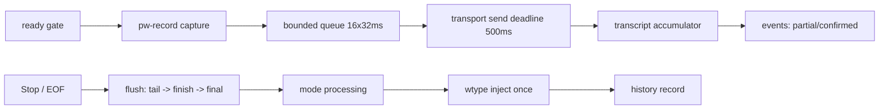

# Syllune 架构

本文描述 Syllune（原 type4me-linux，`migrate-syllune-native-streaming` change 完成后的产物）的运行时边界、持久化契约和集成接口。运行时是单一原生 Rust 二进制 `syllune`，不再依赖 Python；GTK/Adwaita 桌面入口已移除。

## 设计约束

- 音频、模型和历史属于当前用户，不写入 Nix store；模型权重不随仓库分发。
- 默认云端后端 `cloud-realtime`（DashScope OpenAI-Realtime 风格 WebSocket，`qwen3-asr-flash-realtime`）在说话期间持续发送 32 ms PCM 块并消费局部/确认文本；`local-streaming` 使用 Sherpa-ONNX `OnlineRecognizer`，零云端连接。后端失败不隐式切换。
- `coordinator::run_session` 是实时会话唯一的副作用边界：它拥有捕获、传输、转写累加、模式处理、历史写入和注入的顺序，并保证停止冲刷的固定次序与一次注入。
- 连接先于采集：ready 门未通过前不产生任何音频；鉴权/连接失败在捕获构造前结束。
- 稳定协议标识保持不变：CLI 命令与选项、TOML/JSON 字段、模型 ID 和 D-Bus 名称都不翻译。
- 旧 `type4me-linux` XDG 目录永不自动读取、移动或删除。

## 模块分层（rust/）

| 层 | 模块 | 职责 |
| --- | --- | --- |
| 入口 | `main.rs`、`cli_*` 测试 | clap 子命令、退出码 |
| 会话编排 | `coordinator.rs`、`session.rs`、`daemon.rs` | 有界队列、停止冲刷、一次注入；gateway 一次会话 |
| 音频与传输 | `capture.rs`、`realtime.rs`、`local_asr.rs` | `pw-record --raw -` 捕获、DashScope 协议、Sherpa 在线识别 |
| 批量路径 | `batch.rs`、`batch_cmd.rs` | WAV 解析、DashScope 多模态批量、Sherpa 离线 SenseVoice |
| 产品数据 | `modes.rs`、`history.rs`、`processing.rs`、`model_cmd.rs`/`mode_cmd.rs`/`history_cmd.rs` | 模式、SQLite 历史、文本处理、模型目录 CLI |
| 模型供应链 | `models.rs` | 固定目录、HTTPS 下载、SRI SHA-256、成员白名单、manifest、原子激活 |
| 质量门禁 | `benchmark.rs`、`benchmark_cmd.rs`、`latency.rs`、`latency_cmd.rs` | CER 重放、p50/p95/p99 延迟门禁、版本化报告 |
| 系统集成 | `doctor.rs`、`stream.rs`（注入） | 依赖诊断、wtype 注入 |
| 配置 | `config.rs` | 严格 TOML、0600 密钥门禁、`syllune` XDG 根 |

`stream::run_with_control` 把控制源参数化：CLI 走 SIGINT/SIGTERM（第一次停止、第二次取消），daemon 走 channel（Activate/Cancel 语义由 gateway 状态机保证）。

## 会话生命周期



- 正常停止：停止接受新块 → SIGINT 捕获进程 → drain 尾帧 → 队列 FIFO 冲刷 → 一次 `session.finish` → 等待最终事件 → 可选一次注入。功能超时 2 秒。
- 取消：第二次 SIGINT、SIGTERM 或 daemon Cancel；终止捕获与后端会话，发布 `cancelled`，不处理、不记录、不注入任何部分文本。
- 空文本：完成会话，输出 warning，不注入。
- 反压：队列满或单块发送超过 500 ms deadline 时整个会话失败，不丢块、不重排。

## 持久化与 XDG

```text
config  ${XDG_CONFIG_HOME:-~/.config}/syllune      config.toml (0600 密钥门禁)、modes.json
data    ${XDG_DATA_HOME:-~/.local/share}/syllune   models/、history.sqlite3 (WAL, 0600)
cache   ${XDG_CACHE_HOME:-~/.cache}/syllune        model-downloads/
```

模型目录布局：`models/versions/<id>/<version>-<digest12>/`（含 manifest.json）+ `models/<id>/current` 符号链接，原子替换激活。`local-streaming` 会话前重新校验完整性，损坏模型不可用。

历史只记录成功会话的权威文本（raw/processed/final、processing_mode、status、backend），兼容 Python 时代的 `recognition_history` 表结构与游标分页；取消、失败和空会话不写入。

## D-Bus 与 daemon

`syllune daemon` 在会话总线上声明 `dev.syllune.Daemon`（对象 `/dev/syllune/Daemon`，接口 `dev.syllune.Daemon.Controller`），导出 `Activate` 与 `Cancel`。gateway 状态机：idle→Started、recording→Stopping（正常停止）、stopping 期间拒绝并发 Start；会话回收后回到 idle。Sway 快捷键经 busctl 调用 Activate（见 `nix/home-manager.nix`）。

## 质量门禁（真实环境）

| 门禁 | 阈值 | 实测（2026-08-15） | 报告 |
| --- | --- | --- | --- |
| 云端 CER（test split） | ≤ 0.02 | 0.0070（12 样本，0 失败） | `scripts/asr_benchmark/reports/cloud-realtime-test-2026-08-14T20-34-40Z.json` |
| first partial p95 | ≤ 1.0 s | 0.422 s | `scripts/asr_benchmark/reports/latency-cloud-realtime-2026-08-14T21-27-28Z.json` |
| stop→final p50 | ≤ 0.6 s | 0.252 s | 同上 |
| stop→inject p99 | ≤ 1.0 s | 0.535 s | 同上（100 trials，quick 模式，wtype 注入，0 失败） |

缺真实凭据、音频或注入环境时门禁命令退出 2 并标记 unverified，不产生通过结论。本地后端 CER 单独报告，不与云端合并。

## Nix 集成

`flake.nix` 的默认包是 `syllune`（`rustPlatform.buildRustPackage`，提交 `Cargo.lock`；Sherpa-ONNX 走 shared feature + `SHERPA_ONNX_LIB_DIR` 指向 nixpkgs 构建，构建期不联网下载库）。`nix/home-manager.nix` 提供 `programs.syllune`（settings、daemon 服务、Sway 快捷键）。`nix flake check` 在沙箱内运行全部 Rust 测试。

## 从 type4me-linux 迁移

手动边界：旧配置、模型、词汇和历史保留在旧 XDG 目录不被自动导入；迁移步骤与回滚方式见 README「从 type4me-linux 迁移」。
