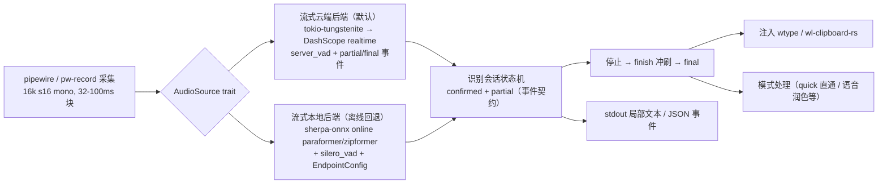

# 极速语音输入：Rust 重写 + 真流式识别方案

> 状态：OpenSpec 已校验；Grilling 决策已确认；最终资产待用户批准
> 日期：2026-08-14
> 目标：**按下"停止输入"快捷键后，1 秒左右输出最终文本；说话过程中实时流式转写，边录边传边出字。**

---

## 1. 目标与成功标准

### 用户价值

语音输入的最强痛点不是"转写准"，而是"说得快、出得慢"。现在必须等整句说完、再等整段转写完，才有结果。本方案把识别改成**边说话边出字**：停止按键按下时，所有内容其实已经转写完成，只差最后一段收尾。

### 可观察成功标准

| 指标 | 目标 | 测量方式 |
| --- | --- | --- |
| 停止按键 → 最终文本注入目标应用 | p50 ≤ 0.6s，p99 ≤ 1.0s | 新延迟基准：记录 stop 时间戳 → finalized 事件 → 注入完成时间戳 |
| 开始说话 → 首个局部文本可见 | ≤ 1.0s（期望 0.3–0.5s） | 同上，首个 partial 事件 |
| 说话中局部文本更新间隔 | ≤ 0.5s | partial 事件时间序列 |
| 识别质量（内容 CER，36 样本库） | 云端 ≤ 0.02（对齐 qwen3-asr-flash 的 0.011）；本地离线单独记录 | 移植 `scripts/asr_benchmark/` 基准 |
| 退出条件 | `cargo test`、`nix build` 全绿；`syllune stream --backend cloud` 全流程可用 | CI + 手动冒烟 |

### 延迟预算分解（停止按键 → 注入）

```
按键停止 → 采集尾包冲刷(≤50ms) → 发送 finish 帧(网络 20–50ms)
→ 服务器 flush 最终文本(200–400ms) → 收到 final → 注入 wtype(50–150ms)
──────────────────────────────────────
合计：典型 0.3–0.6s，最坏 ≤1.0s
```

关键点：**这一段链路里没有"转写整段音频"的时间**——因为整段音频在说话时已经逐块上传并转写完毕。停止后服务器只需 flush 最后一句。

### 非目标

- GUI / 常驻桌面应用重做（CLI 优先，daemon/portal 热键保留为后续阶段）
- 说话人分离、TTS、翻译（服务端能力除外）
- 多语言超出既有 `auto/zh/en/ja/ko/yue` 范围
- 同时跑"本地流式 + 云端流式"双引擎（见 §6 方案 C 分析）
- 语音上传托管服务、插件系统

---

## 2. 现状取证：为什么现在做不到

现有实现（Python，`src/type4me_linux/`）的事实：

- **"流式"是模拟流式**：每 200ms 用 SenseVoice 对不断增长的整段音频重新离线解码（`asr.partial_interval_millis`）。SenseVoice CER 高达 0.1008，仅适合草稿；权威文本要等停止后额外校准（qwen3-sherpa 1.04s）。
- 云端批量 `qwen3-asr-flash-2026-02-10` 质量最好（CER 0.011、0.64s），但走 HTTP base64 直传，**只能说完再转**。
- 此前结论"实时 WebSocket 不可达（404）"**已证伪**：那是路径/协议用错了（见 §3）。

结论：现架构把"质量路径"和"低延迟路径"拆成两条互斥链路，所以无法同时满足"质量高 + 1 秒输出"。必须引入**云端原生流式**作为主链路。

---

## 3. 开源生态调研（2026-08-14 取证）

### 3.1 云端流式：DashScope 实时 WebSocket（关键发现）

上次调研（`openspec/changes/cloud-asr/proposal.md` D3）测试的是 paraformer realtime 旧路径失败，实际存在两条**可用**流式通道，均有真实运行代码为证：

**协议 ①：OpenAI-Realtime 兼容（推荐主用）**
- 端点：`wss://dashscope.aliyuncs.com/api-ws/v1/realtime?model=qwen3-asr-flash-realtime`
- 鉴权：`Authorization: Bearer <api_key>` + `OpenAI-Beta: realtime=v1`
- 客户端事件：`session.update`（`modalities:["text"]`、`input_audio_format:"pcm"`、`sample_rate:16000`、`turn_detection:{type:"server_vad", threshold, silence_duration_ms}`）、`input_audio_buffer.append`（base64 PCM）、`session.finish`
- 服务端事件：`speech_started/stopped`、`conversation.item.input_audio_transcription.text`（局部 `text`+`stash`）、`...completed`（每轮最终）、`session.finished`（最终权威）、`error`
- 证据：<https://github.com/ZIFeIYUuuuuuu/programmer-voice-input>（同场景：程序员语音输入 HUD，Tauri+Rust 实现 `src-tauri/src/realtime_asr.rs`，P50 首字目标 <1.2s）；`qwen3-asr-flash-realtime` 与已实测的批量 `qwen3-asr-flash` 同族（CER 0.011）

**协议 ②：Paraformer Realtime V2（经典 duplex，备用）**
- 端点：`wss://dashscope.aliyuncs.com/api-ws/v1/inference/`
- `run-task`（`task_group:audio, task:asr, function:recognition, model:paraformer-realtime-v2`，参数含 `max_sentence_silence`、`language_hints`）+ 二进制 PCM 帧；`result-generated`（`sentence.text` + `sentence_end`）、`finish-task` 强制 flush
- 证据：<https://github.com/mikuh/dashscope-realtime>（`src/dashscope_realtime/asr.py`、`config.py`）

服务器自带 VAD（server_vad / sentence_end），**本地不需要**为此维护 VAD 状态机。

### 3.2 本地流式：Sherpa-ONNX 在线模型（离线回退）

- 在线 paraformer 双语 zh-en-int8（encoder 158MB，CPU RTF 0.15–0.21，单线程实测；支持普通话/方言+英文，无时间戳）：<https://k2-fsa.github.io/sherpa/onnx/pretrained_models/online-paraformer/paraformer-models.html>
- 在线 zipformer/transducer 系同样可用；监督式端点检测（`EndpointConfig`）提供本地"停止"判定。
- 质量：流式本地模型普遍弱于云端（[INFERENCE] 流式 zipformer/paraformer 在通用语料 CER 约 5–7%，而 qwen3-asr-flash 实测 1.1%），只作离线兜底，不作质量基准。

### 3.3 本地批量：Whisper 系（不推荐做主链路）

- whisper.cpp（vibe 7k star 采用，whisper-rs crate 92 万下载）：质量好但**非流式原生**，需 whisper_streaming 式"重解码增长缓冲+词级时间戳前滚"，实现复杂、CPU 慢；GPU（RTX 3070 CUDA）可快但中文质量仍低于 qwen3-asr-flash（[INFERENCE]）。
- 结论：不作为本轮主链路；`whisper-rs` 列为远期可选后端。

### 3.4 Rust 生态（crates.io 实测，2026-08-14）

| crate | 版本 | 下载量 | 用途 |
| --- | --- | --- | --- |
| `sherpa-onnx` + `sherpa-onnx-sys` | 1.13.3（跟随锁定 nixpkgs） | 20 万 / 19.5 万 | 本地流式 ASR + Silero VAD 的官方安全包装 / FFI |
| `silero_vad` | 0.1.0 | 3.6k | 纯 Rust VAD（可选，云端 server_vad 为主） |
| `whisper-rs` | 0.16.0 | 92 万 | Whisper.cpp 绑定（远期可选） |
| `pipewire` | 0.10.0 | 138 万 | Wayland 原生低延迟采集 |
| `cpal` | 0.18.1 | 1782 万 | 音频采集回退 |
| `tokio-tungstenite` | 0.30.0 | 2.4 亿 | WebSocket 客户端 |
| `wl-clipboard-rs` | 0.9.3 | 1149 万 | 进程内剪贴板（替代外部 wl-copy） |
| `clap` | 4.6.6 | 10 亿 | CLI |
| `ort` | 2.0.0-rc | 1554 万 | ONNX Runtime 安全包装（CUDA） |

---

## 4. 目标架构（Rust 重写）

### 4.1 命名与形态

- 二进制名沿用已批准方向 **`syllune`**（`openspec/changes/migrate-syllune-native-streaming/proposal.md` 记录用户已选择 Syllune）；可在批准时一并确认。
- Cargo workspace 单二进制 `syllune`，子命令保留既有语义：`stream`、`transcribe`、`record`、`model`、`doctor`、`mode`、`history`、`config`、`daemon`。

### 4.2 模块与数据流



### 4.3 会话时序（云端主链路）

```
用户按住/按一下开始 ──▶ ws 连接 + session.update(server_vad)
      │ 持续 30-100ms 一块 PCM → input_audio_buffer.append（边录边传）
  说话中 │ ◀── 每 ~300-500ms: conversation.item...transcription.text (partial) → stdout 实时刷新
      │ ◀── 停顿 > silence_duration: ...completed (final 段) → confirmed
用户停止按键 ──▶ session.finish
      │ ◀── session.finished: 最终权威文本（服务器 flush 最后一句）
      ▼ 模式处理（quick 直通）→ 注入 → 输出
```

### 4.4 事件契约（保留既有核心，破坏性收敛）

沿用现有 JSON 行协议字段（`type/sequence/transcript{confirmed_segments,partial_text,is_final,backend}`），新增 `speech_started/speech_stopped` 可选事件；最终文本**只注入一次**。旧 Python 命令不保留别名（用户已授权破坏性切换）。

### 4.5 配置（移植并收敛）

既有 `config.toml` 严格模式语义不变；`[cloud]` 增加 `realtime_model`（默认 `qwen3-asr-flash-realtime`）、`realtime_endpoint`；`asr.streaming_backend` 枚举改为 `cloud-realtime`（默认）/ `local-streaming`；采样率仍锁定 16k/mono/s16。

---

## 5. 实施阶段（每阶段有退出条件，TDD 每任务红绿闭环）

| 阶段 | 内容 | 退出条件 |
| --- | --- | --- |
| **P0 地基** | cargo workspace + Nix flake（rust-toolchain、sherpa-onnx/onnxruntime 链接、wtype）；配置/模型/路径模块移植；事件契约单元测试 | `nix build`、`cargo test` 绿 |
| **P1 主链路（核心价值）** | pipewire 采集 + DashScope realtime 后端 + 状态机 + 注入；stop→注入延迟基准 | **首个 partial ≤1s；停止→注入 p50 ≤0.6s（实测云端）** |
| **P2 离线回退** | sherpa-onnx 在线模型 + 本地 VAD + 端点检测 | 断网 `stream --backend local-streaming` 可用；本地 CER 记录入库 |
| **P3 全量迁移** | modes/processing/history/daemon/hotkey(portal)/doctor 移植；旧 Python 目录移除 | 原 CLI 能力逐一等价；README/迁移说明更新 |
| **P4 基准与发布** | asr_benchmark 移植（云端 CER/latency）、延迟基准入库、flake 发布 | 回归报告可复现；全量测试绿 |

---

## 6. 方案比较

| 维度 | A：云端实时为主 + 本地离线回退 | B：纯本地流式（sherpa streaming） | C：本地流式预览 + 云端最终 |
| --- | --- | --- | --- |
| 用户价值 | 质量（CER 1.1%）与速度（partial ≤0.5s、stop→inject ≤0.6s）同时满足 | 离线/隐私，但质量 5–7%（≈云端的 1/5），难达标 | 同 A 的质量，但停止后仍要等云端最终，且双引擎常驻成本 |
| 延迟 | 停止后无重转写，链路最短 | 本地 RTF 0.15–0.2，无网络，达标但质量不达标 | 停止时只完成"预览"，权威文本仍要等云端整段 → 无收益 |
| 成本 | 按量计费（~$0.001–0.006/分钟级）| 零 | 双倍计算 + 云端费用 |
| 风险 | 依赖网络与密钥；realtime 模型在账号下的可用性待实测 | 质量硬伤 | 复杂度加倍、延迟反而更差 |
| 可逆性 | 后端可热切换回本地 | 随时可补云端 | 最复杂，难回退 |

**YAGNI 检查**：C 的"本地预览"多余——云端 partial 已 ≤0.5s，本地预览无信息增量；双引擎只服务"断网时还要出字"这一条，交给 B 的后端切换即可。

---

## 7. 推荐方案（A）

云端实时（`qwen3-asr-flash-realtime`，server_vad 边录边传）+ `local-streaming` 离线回退 + 按会话延迟基准。

- 为什么：只有它同时命中"质量 ≥ 云端批量实测（CER 0.011）"与"停止→输出 ≤1s"两个硬指标；Rust 侧只有协议薄层，主链路由 DashScope 托管 RTT 决定（见 §1 预算）。
- 相对 B 牺牲：离线纯本地质量、零成本运行。相对 C 牺牲：无本地实时预览。
- 保留的本地资产：sherpa-onnx 链接方式、模型下载/校验体系（ModelManager 语义）原样移植。
- 命名：按既有批准方向使用 `syllune`（文档内决策项，随本批准一并确认）。

---

## 8. 风险与待验证

| 风险 | 影响 | 缓解 |
| --- | --- | --- |
| [待验证] `qwen3-asr-flash-realtime` 在当前百炼账号下未开通/需单独开通（此前批量模型可用，实时产品线可能独立计费） | 主链路不可用 | 模型候选链：`qwen3-asr-flash-realtime` → `paraformer-realtime-v2` → `gummy-realtime-v1`；P1 首日实测切换 |
| [待验证] 云端 partial/final 的精确 latency（RTT 40ms 内网，服务器行为未知） | 延迟指标漂移 | 延迟基准落地即测；不达标时调 `silence_duration_ms`/分块尺寸 |
| [待验证] `sherpa-onnx` crate 的 API 面（OnlineRecognizer/Vad）细节 | P2 工期 | crate 与 nixpkgs 同版本（1.13.5）；P2 首日冒烟 |
| [待验证] `pipewire` crate 进程内采集在 NixOS 的可用性 | P1 采集延迟 | 保留 `pw-record` 子进程回退路径 |
| 网络中断 | 主链路不可用 | 自动降级 cursor 提示；显式 `--backend local-streaming` |
| 语音数据上云 | 隐私 | README 明示；历史/录音默认不落盘（沿用现语义） |

---

## 9. 决策账本

- 目标与价值：用户要求"停止后 ~1s 出字 + 说话中实时出字 + 高质量"，证据为用户原话（2026-08-14）。
- 约束（硬）：端到端 p50 ≤0.6s / 最坏 ≤1s 一点几；CER 对齐 qwen3-asr-flash（0.011）；NixOS/Wayland 支持；破坏性 Rust 重写。
- 约束（偏好）：CLI 优先；可流式；热键切换。
- 已确认事实：现行模拟流式架构无法达标（§2）；DashScope 真流式两条协议可达（§3.1，代码实证）；Rust 生态齐全（§3.4，crates.io 实测）。
- [INFERENCE]：云端 realtime partial 300–500ms、stop flush 200–400ms（对齐同场景项目 P50<1.2s 目标与 batch 0.64s 实测）。
- [待验证]：见 §8。
- 用户确认状态：**待确认**。