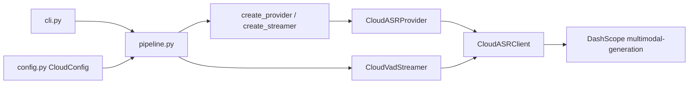

# 设计：云端 ASR

## 架构



新增模块 `src/type4me_linux/cloud_asr.py`，不新增运行时依赖
（stdlib `urllib`，与 `model_manager.HttpsTransport` 一致）。

## 数据模型

```python
class CloudASRError(RuntimeError): ...          # 基类
class CloudASRAuthenticationError(CloudASRError): ...  # 401/403 或密钥缺失
class CloudASRRequestError(CloudASRError): ...         # HTTP/网络/超时
class CloudASRResponseError(CloudASRError): ...        # 响应结构/空文本
```

```python
@dataclass(frozen=True)
class CloudConfig:
    base_url: str = "https://dashscope.aliyuncs.com"   # 主机，不含路径
    api_key: str = ""
    model: str = "qwen3-asr-flash-2026-02-10"
    timeout_seconds: float = 60.0
```

`CloudASRClient`：
- `transcribe_audio(wav_bytes, model, system_prompt=None) -> str`
- 请求：`POST {base_url}/api/v1/services/aigc/multimodal-generation/generation`
- 载荷：`{"model", "input": {"messages": [...]}}`；
  `content = [{"audio": "data:audio/wav;base64,..."}]`；Omni 类模型附带
  system 提示与 `{"text": "请转写"}`。
- 响应解析：`output.choices[0].message.content[0].text`；
  空白文本视为响应错误。
- 重试：429/5xx/网络异常，指数退避（0.5s 起，×2），最多 3 次；
  非重试 HTTP 码立即抛错；4xx 中的 401/403 归为鉴权错误。

`CloudASRProvider(ASRProvider)`：
- `transcribe(wav_path)`：读 WAV → `CloudASRClient` → `RecognitionResult(text, backend="cloud")`。
- `transcribe_samples(samples: np.ndarray) -> str`：float32 采样 → PCM16 编码
  → client（供 CloudVadStreamer 与校准复用）。
- 模型选择：provider 绑定单一 `CloudConfig.model`；
  通过 `system_prompt` 开关区分专用 ASR（无）与 Omni（固定只转写提示）。

`CloudVadStreamer`：
- 复制 `SenseVoiceVadStreamer` 的 VAD 分段/确认/partial 逻辑，
  把 `_decode_samples` 替换为 `cloud.transcribe_samples`；
- 单段失败：跳过该段、发布 `warning` 事件（由 session 层 publish）、不中断；
- `backend` 字段恒为 `"cloud-vad"`。

## 配置接线

- `asr.batch_backend in {"fake","sensevoice","qwen3-sherpa","hybrid","cloud"}`
- `asr.streaming_backend in {"sensevoice-vad","cloud-vad"}`
- `asr.final_backend in {"sensevoice","qwen3-sherpa","cloud"}`
- `ModelManager.active_model_ids` 在 cloud 后端下不引入模型依赖
  （cloud 不需要本地权重）。
- CLI `_add_backend_argument` 的 choices 同步扩展；
  `streaming=True` 时 `cloud-vad`；`streaming=False` 时加 `cloud`。

## 流式接线（pipeline.create_session）

- `streaming_backend == "cloud-vad"` → `_streamer_factory` 换成
  `CloudVadStreamer(config.asr, CloudASRClient(...))`，不经 SenseVoice。
- `final_backend == "cloud"` → 校准器为 `CloudASRProvider`
  （会话结束时对完整会话音频做一次云端转写校准 —— 与 qwen3-sherpa
  校准位相同；flush 前 session 提供的音频缓冲路径复用现有契约）。
- 本地默认（无 `[cloud]` 配置）不动：`create_provider` 仅在
  backend 为 cloud 系列时读取 `CloudConfig`。

## 错误与回退

- 密钥缺失/无效：`CloudASRAuthenticationError`，消息提示设置哪个环境变量。
- 批量命令失败：现有 `main()` 统一捕获打印 `操作失败：...`，退出码 1。
- 流式：逐段失败不中断会话（warning）；云端整体不可用且 `final` 也失败时，
  沿用现有失败历史写入路径。

## 测试策略（TDD）

- `tests/test_cloud_asr.py`：client 部分用 `urllib` 假传输（monkeypatch
  `urlopen`）覆盖请求形状、base64 载荷、重试计数、429/5xx/超时/非预期
  JSON/空文本/鉴权错误；provider 覆盖 `backend=="cloud"` 与 `transcribe_samples`
  PCM16 往返。
- `tests/test_config.py`：`[cloud]` 节校验（未知键、空值、非法 env 名、
  timeout 越界、model 枚举）。
- `tests/test_providers.py` / `test_pipeline.py`：`cloud`/`cloud-vad`
  装配与切换；本地路径回归不变。
- `tests/test_cli.py`：`--backend cloud` / `cloud-vad` 参数选择与
  事件流（假客户端注入）。

## 回归

`scripts/asr_benchmark/benchmark.py --split test`，阈值：
内容 CER 相对上轮劣化 ≤ 0.005。（当前基线见 harness README。）