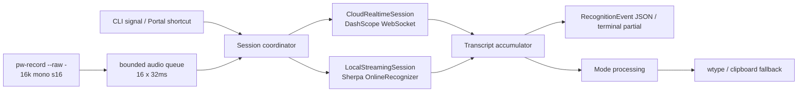

## Context

当前工作区以 Python 3.12 实现 CLI、GTK 桌面应用、PipeWire 采集、Sherpa-ONNX 本地识别、云端批量识别、模型管理、模式、历史和快捷键。实时本地路径重复解码增长中的 VAD 段；`cloud-vad` 则在本地 VAD 端点后才提交片段。两者都没有在说话期间维持云端实时会话，因此停止后仍有整段或整片处理时间。

已批准的概念方案位于 `docs/low-latency-rust-plan.md`。仓库实测批量 `qwen3-asr-flash-2026-02-10` 内容 CER 为 0.0110、平均请求时延 0.64 秒；开源 Rust 实现证明 DashScope OpenAI-Realtime 风格 WebSocket 可通过 `qwen3-asr-flash-realtime` 在采集期间接收局部文本。目标环境是 NixOS/Wayland，当前系统已提供 `pw-record`、`wtype`、Sherpa-ONNX 和可选 CUDA。

## Goals / Non-Goals

**Goals:**

- 用原生 Rust `syllune` 完成 CLI-first clean cutover，最终运行时不依赖 Python。
- 默认云端真流式边录边传，停止时只冲刷尾包和同一会话的最终结果。
- 提供明确选择的本地原生流式后端，不做运行时隐式回退。
- 保留严格配置、模型完整性、模式、历史、headless 快捷键和一次最终注入语义。
- 用真实服务和实际 Wayland 注入验证首字、停止到最终、停止到注入和 CER 门禁。

**Non-Goals:**

- 重写 GTK/Adwaita GUI；本 change 删除 GUI 入口。
- 同时运行本地和云端识别、用本地局部文本覆盖云端局部文本，或在停止后做第二次整段校准。
- 自动迁移旧 XDG 数据、保留旧命令/后端别名，或自动选择不同云端模型。
- 新增说话人分离、TTS、插件系统或通用音频设备管理 UI。

## Architecture

一个会话只实例化一个后端。协调器拥有捕获进程、音频队列、后端会话、转写累加器、取消令牌和一次注入门闩；这些对象在会话结束后全部释放。daemon 可以复用不可变配置、HTTP/WebSocket TLS 客户端和本地 recognizer，但不得复用会话流、转写或终止状态。

## Decisions

### 1. 单个 Tokio 运行时与原生 Rust 包边界

根目录改为 Cargo package/workspace，`syllune` 二进制使用 `tokio`、`clap`、`serde`/`toml`、`tokio-tungstenite`（rustls）、`reqwest`（rustls）、`zbus`、`wl-clipboard-rs` 和 `thiserror`。生产后端使用枚举分派而非动态插件接口；测试通过构造函数注入 capture、transport、clock 和 injector，避免为未批准的插件能力建立 ABI。

Nix 使用 `rustPlatform.buildRustPackage` 和提交的 `Cargo.lock`。`sherpa-onnx = { version = "1.13.3", default-features = false, features = ["shared"] }`，跟随锁定 nixpkgs 的 Sherpa-ONNX 版本；flake 设置 `SHERPA_ONNX_LIB_DIR` 指向 nixpkgs 构建的共享库，禁止 crate build script 联网下载预编译归档。x86_64-linux 可选 CUDA 继续由 nixpkgs 的 Sherpa-ONNX/ONNX Runtime override 提供；aarch64-linux 保持 CPU。

选择理由：一个 async 运行时足以覆盖子进程管道、WebSocket、HTTP、D-Bus 和信号；rustls 避免 OpenSSL 打包分叉；系统共享 Sherpa 库保持 Nix 供应链与现有 CUDA 构建一致。

### 2. P1 复用 `pw-record --raw -`，不先引入直接 PipeWire 绑定

已在目标系统确认 `pw-record [options] [<file>|-]` 支持 `--raw` 和 stdout。P1 以 `pw-record --rate 16000 --channels 1 --format s16 --raw --latency 32ms -` 启动捕获，Rust 从 stdout 聚合成固定 1024 字节（32ms）块。正常停止向捕获进程发送 SIGINT，然后读到 EOF 并交付剩余偶数字节尾帧；强制取消终止进程并丢弃未确认结果。子进程设置 kill-on-drop，任何错误路径都等待或终止子进程，不能留下孤儿。

只有真实基准证明 `pw-record` 本身使门禁失败时，才在同一 `AudioSource` 边界换成 `pipewire` crate；这不是当前默认实现，也不同时维护两套生产捕获路径。

选择理由：当前应用已验证 `pw-record` 在 NixOS/Wayland 可用；直接 PipeWire API 会同时引入线程循环、格式协商和设备生命周期风险，但不会消除云端 flush 的主要时延。

### 3. 连接先于采集，音频队列固定为 16 个块

云端会话先完成 TLS/WebSocket、鉴权和 `session.update`，收到 ready 后才启动捕获并发布 `ready`。采集任务将每个 32ms 块移动进容量 16 的 MPSC 队列（最多 512ms 音频）；发送任务严格按 FIFO 编码并发送。队列满或单次发送超过 500ms 时，会话进入失败态并停止采集；不得丢弃旧块、覆盖新块或无界缓存。

正常停止顺序固定为：停止接受新块 → SIGINT 捕获进程 → drain stdout 尾帧 → drain 有界队列 → 发送一次 `session.finish` → 等待最终事件。功能超时为 2 秒；超过用户 1 秒 SLO 但在 2 秒内成功的会话仍可返回文本，基准必须记录为 SLO 失败。2 秒后按错误路径结束且不注入局部结果。

选择理由：512ms 足以吸收短暂网络抖动，同时把不可恢复的拥塞显式暴露；连接先于采集避免丢失句首。

### 4. 默认使用 DashScope OpenAI-Realtime 风格协议

默认 endpoint 为 `wss://dashscope.aliyuncs.com/api-ws/v1/realtime`，模型为 `qwen3-asr-flash-realtime`。请求使用 `Authorization: Bearer ...` 与 `OpenAI-Beta: realtime=v1`。`session.update` 固定文本模态、PCM/16000 和 server VAD；音频块作为 `input_audio_buffer.append` 事件发送；正常停止使用 `session.finish`。

接收器消费 `session.created/updated`、speech start/stop、`conversation.item.input_audio_transcription.text`、`.completed`、`session.finished` 和 `error`。局部预览按协议的 `text + stash` 组合；完成段追加到 confirmed，后续局部不得修改已确认前缀。最终权威文本优先使用 `session.finished` 的非空文本，否则使用完整 confirmed 累加值；空结果按“无语音”完成，不注入。

不自动切换 `paraformer-realtime-v2` 或其他模型。用户可显式配置另一条已实现协议/模型，但每个会话只选一个；协议不支持或模型无权限时直接失败。这避免跨模型文本漂移和隐式隐私变化。

### 5. 本地后端使用 Sherpa-ONNX OnlineRecognizer

`local-streaming` 使用受模型管理器校验的在线 Paraformer 中英 int8 或后续明确配置的在线模型。每个会话创建独立 OnlineStream，按顺序 `accept_waveform`，在 recognizer ready 时 decode；端点结果追加 confirmed 并重置流，停止时调用 input-finished、解码剩余帧并取得最终文本。daemon 只复用 OnlineRecognizer 和已验证模型路径。

模型目录条目必须在实现前固定 HTTPS URL、完整字节数、SRI SHA-256、允许成员、必需成员和许可证状态。缺任一供应链字段时 `local-streaming` 切片保持未完成，但不阻塞云端 tracer bullet。

选择理由：Sherpa 官方 Rust wrapper 已提供 OnlineRecognizer/OnlineStream，且能通过共享库链接现有 nixpkgs 构建；Whisper 非原生流式，需要重复重解码，不进入本轮。

### 6. 保留事件形状，收敛权威文本边界

JSON 行保持顶层 `type`、`sequence`、`transcript`、`message`、`injection`；`transcript` 保持 `confirmed_segments`、`partial_text`、`authoritative_text`、`is_final`、`backend`。普通终端的局部文本写 stderr，最终文本写 stdout。成功顺序为 `ready` → 零个或多个非最终 transcript → 一个最终 transcript → `finalized` → `completed`；错误为 `error` → `completed`；取消为 `cancelled` → `completed`。

后端局部文本永不注入。最终结果先进入模式处理；`quick` 原样直通，其他模式失败时 warning 并保留识别文本。处理后的最终文本最多调用一次 injector。历史仅在获得权威最终文本后记录；错误、取消和只有局部文本的断线不写成功历史。

### 7. 严格配置与密钥边界

配置继续为严格 TOML，但根目录切换到 Syllune XDG。`streaming_backend` 只接受 `cloud-realtime`/`local-streaming`；删除 `final_backend`、`cloud-vad` 和 `sensevoice-vad`。`[cloud]` 保留 batch 字段并新增 realtime endpoint/model、server VAD threshold/silence、连接/finish timeout；endpoint 必须为 `wss://`。云端密钥按用户既有决定保存在配置文件，但使用前要求文件权限不宽于 0600。

错误和日志实现 `Debug`/`Display` 时只保留密钥是否配置，不保留值；WebSocket request、Authorization header、完整音频和 transcript 默认不进日志。云端模式文档明确音频在会话期间持续发送；本地模式不得创建 HTTP/WebSocket client 请求。

### 8. Headless 快捷键与停止语义统一

`syllune daemon` 用 `zbus` 连接 XDG Desktop Portal GlobalShortcuts，或由用户的 Sway/合成器绑定调用公开 D-Bus 控制入口。所有入口只向同一协调器发送 Start/Stop/Cancel 命令：空闲时激活为 Start，活动时激活为正常 Stop；并发 Start 被拒绝。第一次 SIGINT 等价 Stop，第二次 SIGINT 或 SIGTERM 等价 Cancel。

选择理由：只有一个状态机才能保证停止只发送一次 finish、最终文本只注入一次；快捷键层不拥有音频或识别资源。

### 9. 真实门禁与确定性测试分离

协议测试使用进程内 WebSocket server、伪 `pw-record`、伪 injector 和可控 clock，覆盖部分文本、confirmed、尾帧顺序、背压、断线、鉴权、空文本、信号和一次注入。它们证明行为，不证明外部时延。

真实基准重放版本化 dev/test PCM，在真实 DashScope 区域中记录 capture/start/first-partial/stop/tail-sent/finish-sent/final-received/injection-complete。Wayland 注入门禁至少运行 100 次并计算 p50/p95/p99；CER 使用保留测试集且云端默认阈值为 0.02。本地后端单独报告。CI 缺凭据或 Wayland 时明确 skip，不能生成通过标记。

## Risks / Trade-offs

- realtime 模型可能未对当前账号开通 → **全量 clean cutover 前硬门禁**：P1 必须完成当前账号的鉴权、最小音频、局部文本和 `session.finish` smoke；失败是阻塞证据，不回退并冒充默认路径。
- 云端 1 秒门禁受区域和网络影响 → **全量 clean cutover 前硬门禁**：至少 100 次真实云端 + Wayland 注入试验必须报告区域、RTT、模型和 p50/p95/p99；功能超时与 SLO 分离，超标不能标记通过。
- realtime endpoint 的质量不能由 batch CER 推断 → **独立质量硬门禁**：保留 test CER ≤0.02；不达标时暂停全量切换并重新评估明确的 realtime 后端。
- `pw-record` 子进程增加一次管道边界 → 真实基准裁决；只有证据显示它是瓶颈才换直接 PipeWire。
- Rust wrapper build script 默认下载二进制 → 强制 shared feature、Rust wrapper 1.13.3 与 `SHERPA_ONNX_LIB_DIR`，Nix sandbox 中禁止网络。
- clean cutover 删除 GUI 和旧状态发现 → 旧目录不删除，旧发布物可回装；迁移说明必须在切换前完成。
- `cloud-asr` 已归档为 `2026-08-13-cloud-asr` 并建立 `openspec/specs/asr/spec.md`；本 change 的 `asr` delta 已相对该基线重新校验。

## Migration / Rollback

1. 在不改变安装默认入口的情况下先建立 Rust tracer bullet 与确定性测试。
2. 云端真流式、错误/取消和真实基准达到门禁后，加入本地后端与核心数据工作流。
3. 最后一次切换 flake、Home Manager、桌面/D-Bus 标识到 `syllune`，删除 Python/GTK 产物、旧命令和旧后端配置；旧 XDG 目录不修改。
4. 回滚通过安装旧 Type4Me 发布物并继续读取旧目录；Rust Syllune 的新目录不被旧版读取。由于无自动迁移，两边状态不会混写。

## Open Questions / Gates

- 负责人：实现者。P1 开始前，用当前账号确认 `qwen3-asr-flash-realtime` endpoint、鉴权和 `session.finish` 最终事件；失败阻塞默认后端实现，不改成批量伪流式。
- 负责人：实现者。全量 clean cutover 前，完成至少 100 次真实云端 + Wayland 注入试验与 realtime test CER ≤0.02 门禁；任一失败都阻止删除 Python/GUI/旧入口，并回到 design 评估明确替代后端。
- 负责人：实现者。P2 添加本地模型目录前固定并复核 URL、字节数、SRI、成员与许可证；字段不全时不得安装模型。
- 负责人：维护者。公开发布前完成 Syllune 商标/域名检查；不阻塞本地开发，但阻塞公开品牌声明。
- 负责人：维护者。Rust change 完成后重新严格校验 `asr` 基线和本 change，再执行本 change 的独立 archive dry-run；不得把代码完成当作 archive 确认。
